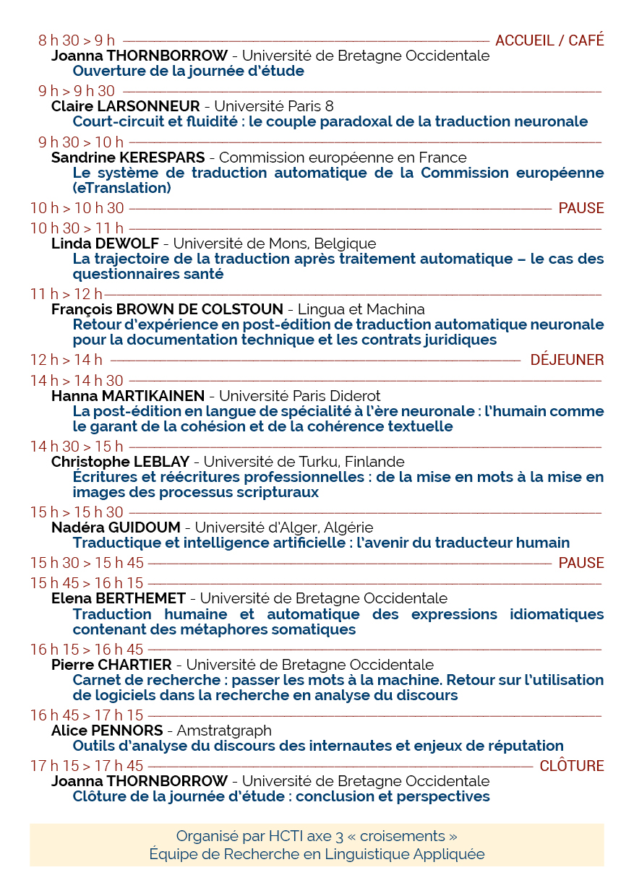

# Mots/Machines #1

 

[Accueil](https://motsmachines.github.io/2019/fr) | [Participations](https://motsmachines.github.io/2019/fr/cfp) | [Programme](https://motsmachines.github.io/2019/fr/program) | [Organisation](https://motsmachines.github.io/2019/fr/orga) | [S'inscrire](https://motsmachines.github.io/2019/fr/registration) | 

 

## Programme

## Résumé des conférences

* **Claire Larsonneur**, Court-circuit et fluidité : le couple paradoxal de la traduction neuronale **[[résumé]](sub/Larsonneur.pdf)**
* **Sandrine Kerespars**, Le système de traduction automatique de la Comission européenne (eTranslation)
* **Linda Dewolf**, La trajectoire de la traduction après traitement automatique – le cas des questionnaires santé **[[résumé]](sub/Dewolf.pdf)**
* **François Brown de Colstoun**, Retour d'expérience en post-édition de traduction automatique neuronale pour la documentation technique et les contrats juridiques.
* **Hanna Martikainen**, La post-édition en langue de spécialité à l'ère neuronale : l’humain comme le garant de la cohésion et de la cohérence textuelle **[[résumé]](sub/Martikainen.pdf)**
* **Christophe Leblay**, Ecritures et réécritures professionnelles : de la mise en mots à la mise en images des processus scripturaux **[[résumé]](sub/Leblay.pdf)**
* **Nadéra Guidoum**, Traductique et intelligence artificielle : l’avenir du traducteur humain **[[résumé]](sub/Guidoum.pdf)**
* **Elena Berthemet**, Traduction humaine et automatique des expressions idiomatiques contenant des métaphores somatiques **[[résumé]](sub/Berthemet.pdf)**
* **Pierre Chartier**, Carnet de recherche : passer les mots à la machine. Retour sur l'utilisation de logiciels dans la recherche en analyse du discours.
* **Alice Pennors**, Outils d'analyse du discours des internautes et enjeux de réputation.
* **Arpine Mkrtchyan**, La problématique de la traduction dans la culture de l’Autre **[[résumé]](sub/Mkrtchyan.pdf)**
